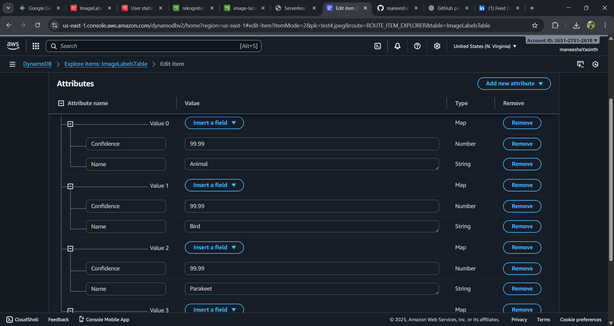

# Serverless Image Labeler 🖼️

## Project Overview

This project demonstrates a fully functional, end-to-end serverless application on AWS that automatically analyzes uploaded images using **Amazon Rekognition** and stores the detected labels in **Amazon DynamoDB**. A secure web frontend allows users to upload images and view the analysis results in real-time.

This project showcases core AWS serverless services, secure client-side authentication, and robust error handling.

## Live Demo

[Watch the Demo Video](https://drive.google.com/uc?export=download&id=1c7cL3ihvw_6CBtxgNrPBrE6UhICU4gLP)


## Architecture

The application leverages the following AWS services:

* **Amazon S3:**
    * **Upload Bucket:** Stores the raw images uploaded by users, triggering the Lambda function.
    * **Frontend Hosting Bucket:** Hosts the static HTML, CSS, and JavaScript for the web application.
* **AWS Lambda:**
    * The core compute service that is invoked by S3 object creation events.
    * Executes Python code to interact with Rekognition and DynamoDB.
* **Amazon Rekognition:** An AI/ML service that performs image analysis to detect objects, scenes, and activities.
* **Amazon DynamoDB:** A NoSQL database that stores the image analysis results (labels and confidence scores).
* **Amazon Cognito Identity Pools:** Provides secure, temporary AWS credentials to the frontend web application, allowing it to upload to S3 and read from DynamoDB without exposing long-term AWS keys.
* **AWS IAM:** Manages fine-grained access control for all services.

**Architecture Diagram:**


*(Replace `YOUR_ARCHITECTURE_DIAGRAM_IMAGE_URL` with the URL to your diagram image)*

## Features

* **Image Upload:** Users can upload JPEG/PNG images via a simple web interface.
* **Automated Analysis:** Images are automatically processed by AWS Rekognition upon upload.
* **Real-time Results:** Detected labels and confidence scores are displayed on the frontend in real-time.
* **Secure Access:** Frontend interactions with AWS services are secured using Cognito Identity Pools and IAM policies.
* **Scalable & Cost-Effective:** Fully serverless architecture scales automatically and is highly cost-effective (mostly within AWS Free Tier).

## Setup and Deployment

This section outlines the steps to deploy the Serverless Image Labeler.

### Prerequisites

* An AWS Account with administrative access.
* AWS CLI (configured).
* Python 3.x.

### 1. Backend Infrastructure (S3, Lambda, Rekognition, DynamoDB)

#### A. DynamoDB Table

1.  Navigate to **DynamoDB** in the `us-east-1` region.
2.  Create a new table named `ImageLabelsTable`.
3.  Set the **Partition key** to `ImageName` (String).
4.  No Sort key is needed for this project.

#### B. S3 Upload Bucket

1.  Create an S3 bucket (e.g., `rekognition-uploads-us-east-1-2025`) in the `us-east-1` region.
2.  Add a **Bucket Policy** to allow Rekognition access:
    ```json
    {
        "Version": "2012-10-17",
        "Id": "PolicyForRekognitionAccess",
        "Statement": [
            {
                "Sid": "AllowRekognitionAccess",
                "Effect": "Allow",
                "Principal": {
                    "Service": "rekognition.amazonaws.com"
                },
                "Action": "s3:GetObject",
                "Resource": "arn:aws:s3:::rekognition-uploads-us-east-1-2025/*"
            }
        ]
    }
    ```
    *(Remember to replace `rekognition-uploads-us-east-1-2025` with your actual bucket name)*

#### C. Lambda Function

1.  Navigate to **Lambda** in the `us-east-1` region.
2.  Create a new function:
    * **Name:** `image-labeling-function`
    * **Runtime:** Python 3.12
    * **Architecture:** `x86_64`
    * **Execution Role:** Create a new role with basic Lambda permissions.
3.  Add **S3 Trigger**:
    * Select your upload bucket (`rekognition-uploads-us-east-1-2025`).
    * Set **Event types** to `All objects create events`.
    * (Optional) Set Prefix/Suffix if you want to filter files.
4.  **Update Lambda Code:** Paste the provided Python code into `lambda_function.py`.
    ```python
    # lambda_function.py
    import json
    import boto3
    import os
    from decimal import Decimal

    s3 = boto3.client('s3')
    rekognition = boto3.client('rekognition', region_name='us-east-1') # Explicitly set region
    dynamodb = boto3.resource('dynamodb')
    table = dynamodb.Table(os.environ['DYNAMODB_TABLE_NAME'])

    def lambda_handler(event, context):
        print(f"Received event: {json.dumps(event)}")
        
        # Check for SNS notification (from S3 failure) or direct S3 event
        if 'Records' not in event:
            print("Event does not contain 'Records' key. This might be a test event or an unexpected format.")
            return {
                'statusCode': 400,
                'body': json.dumps('Event does not contain S3 records.')
            }

        for record in event['Records']:
            if 's3' not in record:
                print("Skipping record as it does not contain S3 information.")
                continue

            bucket_name = record['s3']['bucket']['name']
            object_key = record['s3']['object']['key']

            print(f"Processing image: {object_key} from bucket: {bucket_name}")

            try:
                # Call Rekognition to detect labels
                response = rekognition.detect_labels(
                    Image={
                        'S3Object': {
                            'Bucket': bucket_name,
                            'Name': object_key
                        }
                    },
                    MaxLabels=10,
                    MinConfidence=70
                )

                labels = []
                for label in response['Labels']:
                    # Convert float to Decimal for DynamoDB
                    labels.append({
                        'Name': label['Name'],
                        'Confidence': Decimal(str(label['Confidence'])) 
                    })
                
                # Store results in DynamoDB
                table.put_item(
                    Item={
                        'ImageName': object_key,
                        'Bucket': bucket_name,
                        'Labels': labels,
                        'Status': 'Processed',
                        'Timestamp': str(context.get_remaining_time_in_millis()) # Example timestamp
                    }
                )
                print(f"Successfully processed {object_key} and stored {len(labels)} labels.")

            except Exception as e:
                print(f"Error processing {object_key}: {e}")
                raise e

        return {
            'statusCode': 200,
            'body': json.dumps('Success')
        }
    ```
5.  **Configure Environment Variable:**
    * Add an environment variable: `DYNAMODB_TABLE_NAME = ImageLabelsTable`.
6.  **Update IAM Role Permissions:**
    * Go to the Lambda function's execution role in IAM.
    * Add permissions for `rekognition:DetectLabels` and `dynamodb:PutItem` to your `ImageLabelsTable`.

### 2. Frontend Security (Cognito Identity Pool & IAM)

#### A. Cognito Identity Pool

1.  Navigate to **Cognito** in the `us-east-1` region.
2.  Create a new **Identity Pool**:
    * **Name:** `ImageLabelingIdentityPool`
    * **Authentication type:** Enable `Guest access` (unauthenticated identities).
    * Allow Cognito to create new IAM roles.
3.  **Copy the Identity Pool ID** (e.g., `us-east-1:xxxxxxxx-xxxx-xxxx-xxxx-xxxxxxxxxxxx`). This is crucial for your frontend code.

#### B. Update Cognito's Unauthenticated IAM Role

1.  Go to **IAM** and find the unauthenticated role created by Cognito (e.g., `ImageLabelerGuestRole`).
2.  Attach an **inline policy** to grant specific permissions:
    ```json
    {
        "Version": "2012-10-17",
        "Statement": [
            {
                "Effect": "Allow",
                "Action": [
                    "s3:PutObject"
                ],
                "Resource": "arn:aws:s3:::rekognition-uploads-us-east-1-2025/*" 
            },
            {
                "Effect": "Allow",
                "Action": [
                    "dynamodb:GetItem",
                    "dynamodb:Query"
                ],
                "Resource": "arn:aws:dynamodb:us-east-1:YOUR_ACCOUNT_ID:table/ImageLabelsTable"
            }
        ]
    }
    ```
    *(Replace `rekognition-uploads-us-east-1-2025` and `YOUR_ACCOUNT_ID`)*

### 3. Frontend Application Deployment (S3 Static Website Hosting)

#### A. S3 Frontend Hosting Bucket

1.  Create another S3 bucket (e.g., `image-labeler-frontend-2025`) in `us-east-1`.
2.  **Disable "Block all public access"** for this bucket.
3.  In **Properties**, enable **Static website hosting**. Set **Index document** to `index.html`.
4.  In **Permissions**, add a **Bucket Policy** to allow public read access:
    ```json
    {
        "Version": "2012-10-17",
        "Statement": [
            {
                "Sid": "PublicReadGetObject",
                "Effect": "Allow",
                "Principal": "*",
                "Action": "s3:GetObject",
                "Resource": "arn:aws:s3:::image-labeler-frontend-2025/*" 
            }
        ]
    }
    ```
    *(Replace `image-labeler-frontend-2025` with your actual frontend bucket name)*

#### B. CORS Configuration for the Upload Bucket

1.  Go back to your **image upload bucket** (`rekognition-uploads-us-east-1-2025`).
2.  In the **Permissions** tab, under **Cross-origin resource sharing (CORS)**, click `Edit` and paste the following **JSON** configuration:
    ```json
    [
      {
        "AllowedHeaders": [
          "*"
        ],
        "AllowedMethods": [
          "PUT",
          "POST",
          "GET"
        ],
        "AllowedOrigins": [
          "[http://image-labeler-frontend-2025.s3-website-us-east-1.amazonaws.com](http://image-labeler-frontend-2025.s3-website-us-east-1.amazonaws.com)"
        ],
        "ExposeHeaders": [
          "ETag"
        ],
        "MaxAgeSeconds": 3000
      }
    ]
    ```
    *(**Crucial:** Replace `http://image-labeler-frontend-2025.s3-website-us-east-1.amazonaws.com` with the exact Website Endpoint URL of your frontend hosting bucket.)*

#### C. Frontend Code (`index.html`)

1.  Update the `index.html` file with your specific AWS resource IDs:
    ```html
    <script>
        const REGION = 'us-east-1'; // Project region
        const IDENTITY_POOL_ID = 'us-east-1:xxxxxxxxxxxxxx-xxxxxx-xxxxxxx'; // Your Cognito Identity Pool ID
        const S3_UPLOAD_BUCKET_NAME = 'rekognition-uploads-us-east-1-2025'; // Your S3 upload bucket name
        const DYNAMODB_TABLE_NAME = 'ImageLabelsTable';
        const DYNAMODB_PARTITION_KEY = 'ImageName';
        const POLL_INTERVAL = 3000;
    </script>
    ```
    *(Ensure `IDENTITY_POOL_ID` and `S3_UPLOAD_BUCKET_NAME` are correctly set.)*
2.  **Upload** this `index.html` file to your **frontend hosting bucket**.

## Troubleshooting

* **`Access to XMLHttpRequest... blocked by CORS policy`**: Ensure your **image upload bucket** has the correct CORS JSON policy applied, with the `AllowedOrigins` matching your frontend website's exact URL.
* **`Failed to load resource: the server responded with a status of 404 (Not Found)`**: Check S3 bucket names, object keys, and ensure `index.html` is in your frontend hosting bucket and set as the Index Document.
* **Permissions Errors (e.g., `s3:PutObject denied`)**: Verify your Cognito Unauthenticated IAM Role has the necessary S3 and DynamoDB permissions.
* **DynamoDB `Float types are not supported`**: This was resolved by using `Decimal(str(label['Confidence']))` in the Lambda function.

## Screenshots

**1. Live Application in Action:**


**2. DynamoDB Results:**

---

This `README.md` file covers everything you need. Create the GitHub repository, upload your code files (Python, HTML), add your screenshots and video, and then paste this Markdown content into your `README.md`.
